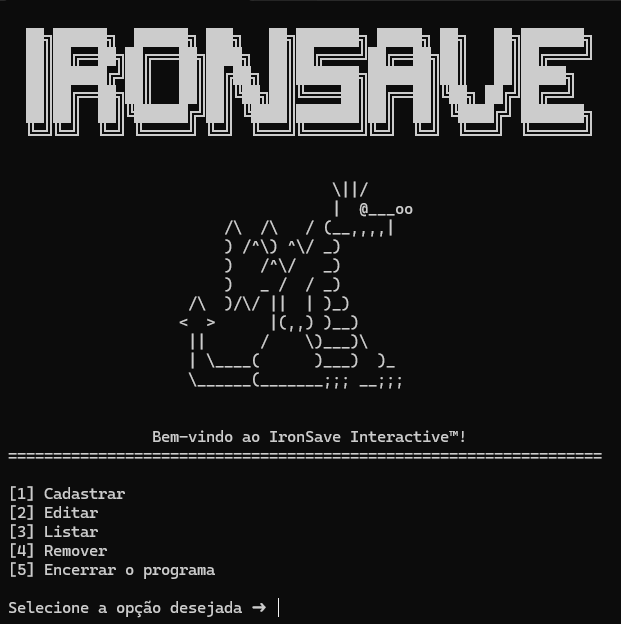

# 🎮 IronSave Interactive

> Sistema CRUD desenvolvido em Python para gerenciamento de jogos finalizados.


---

## 📖 Sobre o projeto

O **IronSave Interactive** é uma aplicação desenvolvida em Python que permite gerenciar uma biblioteca pessoal de jogos finalizados.

O projeto foi criado com o objetivo de aplicar, na prática, conceitos fundamentais de programação e Engenharia de Software, implementando um sistema CRUD (**Create, Read, Update e Delete**) com persistência de dados em arquivo texto.

Durante o desenvolvimento foram utilizados conceitos como:

- Estruturas condicionais
- Laços de repetição
- Funções
- Listas e dicionários
- Manipulação de arquivos
- Organização de projetos
- Versionamento com Git

---

## ✨ Funcionalidades

- 🎮 Cadastro de jogos
- 📋 Listagem dos jogos cadastrados
- ✏️ Edição das informações
- 🗑️ Remoção de jogos
- 💾 Persistência dos dados em arquivo `.txt`
- ✔️ Validação de entradas do usuário

---

## 🖥️ Demonstração

> 

---

## 📂 Estrutura do projeto

```text
IronSaveInteractive/
│
├── database/
│   └── ironsave_database.txt
│
├── docs/
│   └── Documento de Especificação.pdf
│
├── src/
│   ├── IronSave.py
│   └── Script.bat
│
├── README.md
├── requirements.txt
├── LICENSE
└── .gitignore
```

---

## ⚙️ Tecnologias utilizadas

- Python 3
- Tabulate
- Git
- GitHub
- Visual Studio Code

---

## 🚀 Como executar

### Clone o repositório

```bash
git clone https://github.com/SEU-USUARIO/IronSaveInteractive.git
```

### Entre na pasta

```bash
cd IronSaveInteractive
```

### Instale as dependências

```bash
pip install -r requirements.txt
```

### Execute o projeto

```bash
python src/IronSave.py
```

---

## 📄 Documentação

A documentação completa do projeto encontra-se na pasta **docs**, contendo:

- Visão geral
- Objetivos
- Modelo de dados
- Funcionalidades
- Tecnologias
- Resultados esperados

---

## 🎯 Objetivos de aprendizagem

Este projeto foi desenvolvido para praticar:

- Programação em Python
- Estruturas de dados
- Manipulação de arquivos
- Organização de código
- Desenvolvimento de aplicações CRUD
- Engenharia de Software
- Git e GitHub

---

## 🚀 Melhorias futuras

- Banco de dados SQLite
- Interface gráfica
- Pesquisa de jogos
- Ordenação por nota
- Sistema de filtros
- Exportação para PDF
- Estatísticas da biblioteca

---

## 👨‍💻 Autor

**Kevin Valone Brilhante**

Estudante de Engenharia de Software.

---

## 📜 Licença

Este projeto está licenciado sob a licença MIT.